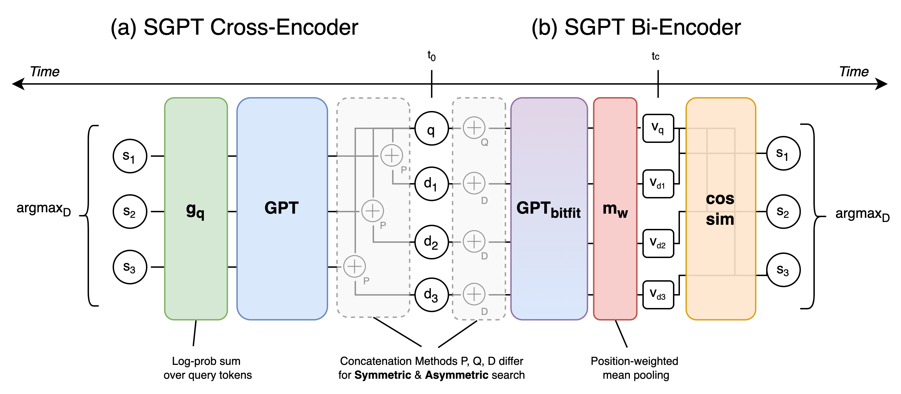

## SGPT: GPT Sentence Embeddings for Semantic Search

This repository contains code, results and pre-trained models for the paper [SGPT: GPT Sentence Embeddings for Semantic Search](https://arxiv.org/abs/2202.08904).

**************************** Updates ****************************

### Quick Links

  - [Overview](#overview)
  - [Structure](#structure)
  - [Use SGPT with Huggingface](#use-sgpt-with-huggingface)
    - [Bi-encoder](#biencoder)
    - [Cross-encoder](#crossencoder)
  - [Acknowledgements](#acknowledgements)
  - [Citation](#citation)

### Overview

We present SGPT-BE and SGPT-CE for applying GPT models as Bi-Encoders or Cross-Encoders to symmetric or asymmetric search. SGPT-BE produces semantically meaningful sentence embeddings by contrastive fine-tuning of only bias tensors and position-weighted mean pooling. SGPT-CE uses log probabilities from GPT models without any fine-tuning. An illustration of the methods follows.



Feel free to open an issue should you have any questions~

### Structure

```bash
.
├── biencoder  # Training & Inference of Bi-Encoders
│   ├── beir
│   │   ├── custommodels # Directory providing BEIR compatibility for asymmetric mdoels & models with special tokens
│   │   │   └── ...
│   │   ├── io_utils # Exclusively used for beir_openai_embeddings_batched_parallel.py
│   │   │   └── ...
│   │   ├── parallelizer # Exclusively used for beir_openai_embeddings_batched_parallel.py
│   │   │   └── ...
│   │   ├── beir_dense_retriever.py
│   │   ├── beir_openai_embeddings_batched_parallel.py
│   │   ├── requirements.txt
│   │   ├── *.bash # Bash scripts to run multiple experiments
│   │   └── README.md
│   ├── nli_msmarco
│   │   ├── sentence-transformers # An adapted version of sentence-transformers - Install this version for all biencoder experiments
│   │   │   └── ...
│   │   └── README.md
│   └── useb
│       ├── useb
│       │   └── ...
│       ├── *.bash # Bash scripts to run multiple experiments
│       ├── useb_dense_retriever.py
│       └── README.md
├── crossencoder  # Inference of crossencoders
│   └── beir
│       ├── *.ipynb # Notebooks explained in the README
│       └── README.md
├── other
│   ├── sgpt_graphic.png
│   └── sgpt_utils.ipynb # Code for creating the graphs in the paper & other
├── requirements.txt
└── README.md
```

Each data sub-directory provides its own README with an overview of its **Structure**, **Downloads** (Datasets, Models) & **Commands** used to produce the datasets, models & other things. Generally, you can find all models at https://huggingface.co/Muennighoff and json results in various datasets at https://www.kaggle.com/muennighoff/datasets. Model names are explained in their Huggingface READMEs. Dataset names are explained in the sub-folders of this repository.


### Use SGPT with Huggingface

Below we provide python examples to use the pre-trained models for your own semantic search use case.
We highly recommend replacing the model names with larger models, e.g. `Muennighoff/SGPT-5.8B-weightedmean-nli-bitfit` for biencoder/symmetric.

#### Biencoder

##### Symmetric Semantic Search

```python
import torch
from transformers import AutoModel, AutoTokenizer
from scipy.spatial.distance import cosine

# Get our models - The package will take care of downloading the models automatically
# For best performance: Muennighoff/SGPT-5.8B-weightedmean-nli-bitfit
tokenizer = AutoTokenizer.from_pretrained("Muennighoff/SGPT-125M-weightedmean-nli-bitfit")
model = AutoModel.from_pretrained("Muennighoff/SGPT-125M-weightedmean-nli-bitfit")

# Tokenize input texts
texts = [
    "deep learning",
    "artificial intelligence",
    "deep throating",
    "artificial snow",
]
batch_tokens = tokenizer(texts, padding=True, truncation=True, return_tensors="pt")

# Get the embeddings
with torch.no_grad():
    # Get hidden state of shape [bs, seq_len, hid_dim]
    last_hidden_state = model(**batch_tokens, output_hidden_states=True, return_dict=True).last_hidden_state

# Get weights of shape [bs, seq_len, hid_dim]
weights = (
    torch.arange(start=1, end=last_hidden_state.shape[1] + 1)
    .unsqueeze(0)
    .unsqueeze(-1)
    .expand(last_hidden_state.size())
    .float().to(last_hidden_state.device)
)

# Get attn mask of shape [bs, seq_len, hid_dim]
input_mask_expanded = (
    batch_tokens["attention_mask"]
    .unsqueeze(-1)
    .expand(last_hidden_state.size())
    .float()
)

# Perform weighted mean pooling across seq_len: bs, seq_len, hidden_dim -> bs, hidden_dim
sum_embeddings = torch.sum(last_hidden_state * input_mask_expanded * weights, dim=1)
sum_mask = torch.sum(input_mask_expanded * weights, dim=1)

embeddings = sum_embeddings / sum_mask

# Calculate cosine similarities
# Cosine similarities are in [-1, 1]. Higher means more similar
cosine_sim_0_1 = 1 - cosine(embeddings[0], embeddings[1])
cosine_sim_0_2 = 1 - cosine(embeddings[0], embeddings[2])
cosine_sim_0_3 = 1 - cosine(embeddings[0], embeddings[3])

print("Cosine similarity between \"%s\" and \"%s\" is: %.3f" % (texts[0], texts[1], cosine_sim_0_1))
print("Cosine similarity between \"%s\" and \"%s\" is: %.3f" % (texts[0], texts[2], cosine_sim_0_2))
print("Cosine similarity between \"%s\" and \"%s\" is: %.3f" % (texts[0], texts[3], cosine_sim_0_3))
```

##### Asymmetric Semantic Search

```python
import torch
from transformers import AutoModel, AutoTokenizer
from scipy.spatial.distance import cosine

# Get our models - The package will take care of downloading the models automatically
# For best performance: Muennighoff/SGPT-5.8B-weightedmean-msmarco-specb-bitfit
tokenizer = AutoTokenizer.from_pretrained("Muennighoff/SGPT-125M-weightedmean-msmarco-specb-bitfit")
model = AutoModel.from_pretrained("Muennighoff/SGPT-125M-weightedmean-msmarco-specb-bitfit")

queries = [
    "I'm searching for a planet not too far from Earth.",
]

docs = [
    "Neptune is the eighth and farthest-known Solar planet from the Sun. In the Solar System, it is the fourth-largest planet by diameter, the third-most-massive planet, and the densest giant planet. It is 17 times the mass of Earth, slightly more massive than its near-twin Uranus.",
    "TRAPPIST-1d, also designated as 2MASS J23062928-0502285 d, is a small exoplanet (about 30% the mass of the earth), which orbits on the inner edge of the habitable zone of the ultracool dwarf star TRAPPIST-1 approximately 40 light-years (12.1 parsecs, or nearly 3.7336×1014 km) away from Earth in the constellation of Aquarius.",
    "A harsh desert world orbiting twin suns in the galaxy’s Outer Rim, Tatooine is a lawless place ruled by Hutt gangsters. Many settlers scratch out a living on moisture farms, while spaceport cities such as Mos Eisley and Mos Espa serve as home base for smugglers, criminals, and other rogues.",
]

SPECB_QUE_BOS = tokenizer.encode("[", add_special_tokens=False)[0]
SPECB_QUE_EOS = tokenizer.encode("]", add_special_tokens=False)[0]

SPECB_DOC_BOS = tokenizer.encode("{", add_special_tokens=False)[0]
SPECB_DOC_EOS = tokenizer.encode("}", add_special_tokens=False)[0]


def tokenize_with_specb(texts, is_query):
    # Tokenize without padding
    batch_tokens = tokenizer(texts, padding=False, truncation=True)   
    # Add special brackets & pay attention to them
    for seq, att in zip(batch_tokens["input_ids"], batch_tokens["attention_mask"]):
        if is_query:
            seq.insert(0, SPECB_QUE_BOS)
            seq.append(SPECB_QUE_EOS)
        else:
            seq.insert(0, SPECB_DOC_BOS)
            seq.append(SPECB_DOC_EOS)
        att.insert(0, 1)
        att.append(1)
    # Add padding
    batch_tokens = tokenizer.pad(batch_tokens, padding=True, return_tensors="pt")
    return batch_tokens

def get_weightedmean_embedding(batch_tokens, model):
    # Get the embeddings
    with torch.no_grad():
        # Get hidden state of shape [bs, seq_len, hid_dim]
        last_hidden_state = model(**batch_tokens, output_hidden_states=True, return_dict=True).last_hidden_state

    # Get weights of shape [bs, seq_len, hid_dim]
    weights = (
        torch.arange(start=1, end=last_hidden_state.shape[1] + 1)
        .unsqueeze(0)
        .unsqueeze(-1)
        .expand(last_hidden_state.size())
        .float().to(last_hidden_state.device)
    )

    # Get attn mask of shape [bs, seq_len, hid_dim]
    input_mask_expanded = (
        batch_tokens["attention_mask"]
        .unsqueeze(-1)
        .expand(last_hidden_state.size())
        .float()
    )

    # Perform weighted mean pooling across seq_len: bs, seq_len, hidden_dim -> bs, hidden_dim
    sum_embeddings = torch.sum(last_hidden_state * input_mask_expanded * weights, dim=1)
    sum_mask = torch.sum(input_mask_expanded * weights, dim=1)

    embeddings = sum_embeddings / sum_mask

    return embeddings


query_embeddings = get_weightedmean_embedding(tokenize_with_specb(queries, is_query=True), model)
doc_embeddings = get_weightedmean_embedding(tokenize_with_specb(docs, is_query=False), model)

# Calculate cosine similarities
# Cosine similarities are in [-1, 1]. Higher means more similar
cosine_sim_0_1 = 1 - cosine(query_embeddings[0], doc_embeddings[0])
cosine_sim_0_2 = 1 - cosine(query_embeddings[0], doc_embeddings[1])
cosine_sim_0_3 = 1 - cosine(query_embeddings[0], doc_embeddings[2])

print("Cosine similarity between \"%s\" and \"%s\" is: %.3f" % (queries[0], docs[0][:20] + "...", cosine_sim_0_1))
print("Cosine similarity between \"%s\" and \"%s\" is: %.3f" % (queries[0], docs[1][:20] + "...", cosine_sim_0_2))
print("Cosine similarity between \"%s\" and \"%s\" is: %.3f" % (queries[0], docs[2][:20] + "...", cosine_sim_0_3))
```

#### Crossencoder

##### Asymmetric Semantic Search

```python
import torch
from transformers import AutoModelForCausalLM, AutoTokenizer
from scipy.spatial.distance import cosine

# Get models - The package will take care of downloading the models automatically
# For best performance: EleutherAI/gpt-j-6B
tokenizer = AutoTokenizer.from_pretrained("EleutherAI/gpt-neo-125M")
model = AutoModelForCausalLM.from_pretrained("EleutherAI/gpt-neo-125M")

prompt = 'Documents are searched to find matches with the same content.\nThe document "{}" is a good search result for "'

queries = [
    "I'm searching for a planet not too far from Earth.",
]

docs = [
    "Neptune is the eighth and farthest-known Solar planet from the Sun. In the Solar System, it is the fourth-largest planet by diameter, the third-most-massive planet, and the densest giant planet. It is 17 times the mass of Earth, slightly more massive than its near-twin Uranus.",
    "TRAPPIST-1d, also designated as 2MASS J23062928-0502285 d, is a small exoplanet (about 30% the mass of the earth), which orbits on the inner edge of the habitable zone of the ultracool dwarf star TRAPPIST-1 approximately 40 light-years (12.1 parsecs, or nearly 3.7336×1014 km) away from Earth in the constellation of Aquarius.",
    "A harsh desert world orbiting twin suns in the galaxy’s Outer Rim, Tatooine is a lawless place ruled by Hutt gangsters. Many settlers scratch out a living on moisture farms, while spaceport cities such as Mos Eisley and Mos Espa serve as home base for smugglers, criminals, and other rogues.",
]

for query in queries:
    print(f"Query: {query}")
    for doc in docs:
        context = prompt.format(doc)

        context_enc = tokenizer.encode(context, add_special_tokens=False)
        continuation_enc = tokenizer.encode(query, add_special_tokens=False)
        # Slice off the last token, as we take its probability from the one before
        model_input = torch.tensor(context_enc+continuation_enc[:-1])
        continuation_len = len(continuation_enc)
        input_len, = model_input.shape

        # [seq_len] -> [seq_len, vocab]
        logprobs = torch.nn.functional.log_softmax(model(model_input)[0], dim=-1).cpu()
        # [seq_len, vocab] -> [continuation_len, vocab]
        logprobs = logprobs[input_len-continuation_len:]
        # Gather the log probabilities of the continuation tokens -> [continuation_len]
        logprobs = torch.gather(logprobs, 1, torch.tensor(continuation_enc).unsqueeze(-1)).squeeze(-1)
        score = torch.sum(logprobs)
        # The higher (closer to 0), the more similar
        print(f"Document: {doc[:20] + '...'} Score: {score}")
```

##### Symmetric Semantic Search

You can use the same code as in the above [CE-Asym section](#asymmetric-semantic-search-1) but change the prompt. Feel free to share prompts that work well :)

### Acknowledgements

We thank Constantin Eichenberg and Samuel Weinbach for insightful discussions and valuable feedback throughout the project. We thank Robert Baldock, Marco Bellagente and Koen Oostermeijer for reading drafts of the paper. This work has been supported by OpenAI under the academic access program. 
This work would not have been possible without:
- UKPLab: [SBERT](https://github.com/UKPLab/sentence-transformers), [BEIR](https://github.com/UKPLab/beir), [USEB](https://github.com/UKPLab/useb)
- [Eleuther AI Models](https://github.com/EleutherAI/gpt-neox)
- [Huggingface Transformers](https://github.com/huggingface/transformers)

### Citation

Feel free to cite our paper if SGPT is helpful to you :) 

```bibtex
@article{muennighoff2022sgpt,
  title={SGPT: GPT Sentence Embeddings for Semantic Search},
  author={Muennighoff, Niklas},
  journal={arXiv preprint arXiv:2202.08904},
  year={2022}
}
```
