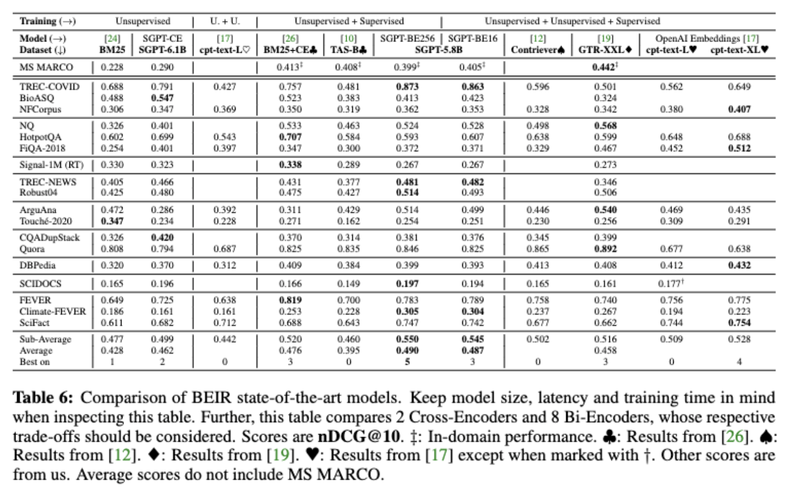

## Bi-Encoder on NLI & MSMARCO (Training + Inference)

This module is for training biencoders on NLI & MSMARCO, also see https://github.com/UKPLab/sentence-transformers.

### Structure

- `sentence-transformers`: Folder with a slightly adapted version of https://github.com/UKPLab/sentence-transformers. Refer to the README in the folder for the changes.

### Downloads

STS-B evaluations are included in the model files available at https://huggingface.co/Muennighoff.
We did not evaluate on NLI. MSMARCO evaluation for `SGPT-6.1B-weightedmean-msmarco-specb-bitfit` is available in `sgpt/biencoder/beir`.

### Commands

Below are all commands used for all models trained in the paper and available at https://huggingface.co/Muennighoff.

#### Requirements

Install accelerator:
Installed via source install at commit `29a09a8ddc1e19f6dd544e709dd865b9dbfcb709`:
`pip install git+https://github.com/huggingface/accelerate`.
A later version should also work.

Configuration (will show up after `accelerate config`):
```
In which compute environment are you running? ([0] This machine, [1] AWS (Amazon SageMaker)): 0
Which type of machine are you using? ([0] No distributed training, [1] multi-CPU, [2] multi-GPU, [3] TPU): 2
How many different machines will you use (use more than 1 for multi-node training)? [1]: 1
Do you want to use DeepSpeed? [yes/NO]:
How many processes in total will you use? [1]: 1, 2 or 8 (Depending on number of GPUs for experiment)
Do you wish to use FP16 (mixed precision)? [yes/NO]:
```

Install sentence-transformers from source from the `sentence-transformers` folder:
`cd sentence-transformers; pip install -e .`

Install wandb if you would like to use it:
`pip install wandb`

In a conda env this might look like:
```bash
conda create --name sgpt
conda install pytorch torchvision cudatoolkit=11.3 -c pytorch
~/conda/envs/sgpt/bin/pip install git+https://github.com/huggingface/accelerate
~/conda/envs/sgpt/bin/pip install -e . 
conda install -c conda-forge wandb
```

#### Biencoder on NLI - "Symmetric Semantic Search" (Training + Inference)

Training of `SBERT-base-nli-v2` on 1 40GiB GPU:

```bash
accelerate config
accelerate launch examples/training/nli/training_nli_v2.py --model_name bert-base-uncased --pooling mean
```

Training of `SBERT-large-nli-v2` on 1 40GiB GPU:

```bash
accelerate config
accelerate launch examples/training/msmarco/training_nli_v2.py --modelname bert-large-uncased
```

Training of `SGPT-125M-mean-nli` on 1 24GiB GPU:

```bash
accelerate config
accelerate launch --main_process_port 1469 examples/training/nli/training_nli_v2.py --model_name EleutherAI/gpt-neo-125M --pooling mean
```

Training of `SGPT-125M-weightedmean-nli` on 1 24GiB GPU::

```bash
accelerate config
accelerate launch --main_process_port 1469 examples/training/nli/training_nli_v2.py --model_name EleutherAI/gpt-neo-125M --pooling weightedmean
```

Training of `SGPT-1.3B-mean-nli` on 8 40GiB GPUs::

```bash
cd sentence-transformers
accelerate config
accelerate launch --main_process_port 1469 examples/training/nli/training_nli_v2.py --model_name EleutherAI/gpt-neo-1.3B --train_batch_size 6 --lr 1e-5 --pooling mean
```

Training of `SGPT-1.3B-weightedmean-nli` on 8 40GiB GPUs::

```bash
cd sentence-transformers
accelerate config
accelerate launch --main_process_port 1469 examples/training/nli/training_nli_v2.py --model_name EleutherAI/gpt-neo-1.3B --train_batch_size 6 --lr 1e-5 --pooling weightedmean
```

Training of `SGPT-125M-mean-nli-linear5` on 4 40GiB GPUs:

```bash
accelerate config
accelerate launch examples/training/nli/training_nli_v2.py --model_name EleutherAI/gpt-neo-125M --freeze --addxlinear 5 --wandb --useact
```

Training of `SGPT-125M-mean-nli-linearthenpool5` on 4 40GiB GPUs:

```bash
accelerate config
accelerate launch examples/training/nli/training_nli_v2.py --model_name EleutherAI/gpt-neo-125M --freeze --addxlinear 5 --linearthenpool --wandb --useact
```

Training of `SGPT-125M-weightedmean-nli-linearthenpool5` on 4 40GiB GPUs:

```bash
accelerate config
accelerate launch examples/training/nli/training_nli_v2.py --model_name EleutherAI/gpt-neo-125M --freeze --addxlinear 5 --linearthenpool --wandb --pooling weightedmean --useact
```

Training of `SGPT-1.3B-mean-nli-linearthenpool5` on 4 40GiB GPUs:

```bash
cd sentence-transformers
accelerate config
accelerate launch --main_process_port 1469 examples/training/nli/training_nli_v2.py --model_name EleutherAI/gpt-neo-1.3B --train_batch_size 16 --lr 2e-5 --pooling mean --addxlinear 5 --linearthenpool --useact
```

Training of `SGPT-1.3B-weightedmean-nli-bitfit` on 8 40GiB GPUs:

```bash
accelerate config
accelerate launch examples/training/nli/training_nli_v2.py --model_name EleutherAI/gpt-neo-1.3B --train_batch_size 6 --lr 1e-4 --pooling weightedmean --wandb --freeze --freezenonbias --wandbwatchlog gradients
```

Training of `SGPT-2.7B-weightedmean-nli-bitfit` on 8 40GiB GPUs:

```bash
accelerate config
accelerate launch examples/training/nli/training_nli_v2.py --model_name EleutherAI/gpt-neo-2.7B --freezenonbias --train_batch_size 8 --lr 2e-4 --pooling weightedmean --wandb --wandbwatchlog gradients
```

Training of `SGPT-5.8B-weightedmean-nli-bitfit-bs48` on 8 40GiB GPUs:

```bash
accelerate config
accelerate launch examples/training/nli/training_nli_v2.py --model_name EleutherAI/gpt-j-6B --freezenonbias --train_batch_size 6 --lr 1e-4 --pooling weightedmean --wandb --wandbwatchlog gradients
```

The model in the paper uses GradCache in order to use a larger batch size:

Training of `SGPT-5.8B-weightedmean-nli-bitfit` on 8 40GiB GPUs:

```bash
accelerate config
cd sentence-transformers
accelerate config
CUDA_VISIBLE_DEVICES=0,1,2,3,4,5,6,7 accelerate launch examples/training/nli/training_nli_v2.py --model_name EleutherAI/gpt-j-6B --freezenonbias --train_batch_size 128 --lr 32e-5 --pooling weightedmean --wandb --wandbwatchlog gradients --gradcache --chunksize 4
```

This model uses GradCache, a technique for gradient accumulation with contrastive learning. Its total batch size is 128 * 8 = 1024. It's memory consumption is equivalent to using a batch size of 4 (chunksize). 

On USEB going from a batch size of 48 to 1024 yielded a 4% average performance increase. The performances can be compared by looking at the two USEB tables in the paper.


#### Biencoder on MSMARCO - "Asymmetric Semantic Search" (Training + Inference)


Training of `SBERT-base-msmarco` on 2 40GiB GPUs:

```bash
accelerate config
CUDA_VISIBLE_DEVICES=0,1 accelerate launch --main_process_port 2222 examples/training/ms_marco/train_bi-encoder_mnrl.py --model_name bert-base-uncased --train_batch_size 32 --wandb --wandbwatchlog gradients
```


Training of `SBERT-base-msmarco-bitfit` on 2 40GiB GPUs:

```bash 
accelerate config
CUDA_VISIBLE_DEVICES=4,5 accelerate launch --main_process_port 2224 examples/training/ms_marco/train_bi-encoder_mnrl.py --model_name bert-base-uncased --train_batch_size 32 --wandb --wandbwatchlog gradients --freezenonbias --lr 2e-4
```


Training of `SBERT-base-msmarco-bitfit-asym` on 2 40GiB GPUs:

```bash
accelerate config
CUDA_VISIBLE_DEVICES=4,5 accelerate launch --main_process_port 2223 examples/training/ms_marco/train_bi-encoder_mnrl.py --model_name bert-base-uncased --train_batch_size 32 --freezenonbias --asym --wandb --wandbwatchlog gradients
```

Training of `SGPT-125M-weightedmean-msmarco` on 2 40GiB GPUs:

```bash
accelerate config
CUDA_VISIBLE_DEVICES=4,5 accelerate launch --main_process_port 2224 examples/training/ms_marco/train_bi-encoder_mnrl.py --model_name EleutherAI/gpt-neo-125M --train_batch_size 32 --wandb --wandbwatchlog gradients
```

Training of `SGPT-125M-weightedmean-msmarco-asym` on 2 40GiB GPUs:

```bash
accelerate config
CUDA_VISIBLE_DEVICES=4,5 accelerate launch --main_process_port 2224 examples/training/ms_marco/train_bi-encoder_mnrl.py --model_name EleutherAI/gpt-neo-125M --train_batch_size 32 --asym --wandb --wandbwatchlog gradients
```

Training of `SGPT-125M-weightedmean-msmarco-bitfit` on 2 40GiB GPUs:

```bash
accelerate config
CUDA_VISIBLE_DEVICES=4,5 accelerate launch --main_process_port 2224 examples/training/ms_marco/train_bi-encoder_mnrl.py --model_name EleutherAI/gpt-neo-125M --train_batch_size 32 --freezenonbias --lr 2e-4 --wandb --wandbwatchlog gradients
```


Training of `SGPT-125M-weightedmean-msmarco-bitfit` on 2 40GiB GPUs:

```bash
accelerate config
CUDA_VISIBLE_DEVICES=0,1 accelerate launch --main_process_port 2225 examples/training/ms_marco/train_bi-encoder_mnrl.py --model_name EleutherAI/gpt-neo-125M --train_batch_size 32 --freezenonbias --lr 8e-4 --wandb --wandbwatchlog gradients
```

Training of `SGPT-125M-weightedmean-msmarco-speca-bitfit` on 2 40GiB GPUs:

```bash
CUDA_VISIBLE_DEVICES=4,5 accelerate launch --main_process_port 2224 examples/training/ms_marco/train_bi-encoder_mnrl.py --model_name EleutherAI/gpt-neo-125M --train_batch_size 32 --wandb --wandbwatchlog gradients --speca --pooling weightedmean
```

Training of `SGPT-125M-lasttoken-msmarco-speca-bitfit` on 2 40GiB GPUs:

```bash
CUDA_VISIBLE_DEVICES=6,7 accelerate launch --main_process_port 2225 examples/training/ms_marco/train_bi-encoder_mnrl.py --model_name EleutherAI/gpt-neo-125M --train_batch_size 32 --wandb --wandbwatchlog gradients --speca --pooling lasttoken
```


Training of `SGPT-125M-weightedmean-msmarco-specb-bitfit` on 2 40GiB GPUs:

```bash
CUDA_VISIBLE_DEVICES=4,5 accelerate launch --main_process_port 2224 examples/training/ms_marco/train_bi-encoder_mnrl.py --model_name EleutherAI/gpt-neo-125M --train_batch_size 32 --wandb --wandbwatchlog gradients --specb --pooling weightedmean
```

Training of `SGPT-125M-lasttoken-msmarco-specb-bitfit` on 2 40GiB GPUs::

```bash
CUDA_VISIBLE_DEVICES=6,7 accelerate launch --main_process_port 2225 examples/training/ms_marco/train_bi-encoder_mnrl.py --model_name EleutherAI/gpt-neo-125M --train_batch_size 32 --wandb --wandbwatchlog gradients --specb --pooling lasttoken
```

Training of `SGPT-1.3B-weightedmean-msmarco-specb-bitfit` on 8 40GiB GPUs:

```bash
accelerate config
CUDA_VISIBLE_DEVICES=0,1,2,3,4,5,6,7 accelerate launch --main_process_port 2222 examples/training/ms_marco/train_bi-encoder_mnrl.py --model_name EleutherAI/gpt-neo-1.3B --train_batch_size 8 --freezenonbias --specb --lr 2e-4 --wandb --wandbwatchlog gradients --pooling weightedmean
```

Training of `SGPT-2.7B-weightedmean-msmarco-specb-bitfit` on 8 40GiB GPUs::

```bash
accelerate config
CUDA_VISIBLE_DEVICES=0,1,2,3,4,5,6,7 accelerate launch --main_process_port 2222 examples/training/ms_marco/train_bi-encoder_mnrl.py --model_name EleutherAI/gpt-neo-2.7B --train_batch_size 4 --eval_batch_size 4 --freezenonbias --specb --lr 0.75e-4 --wandb --wandbwatchlog gradients --pooling weightedmean
```

Training of `SGPT-2.7B-weightedmean-msmarco-specb-bitfit-bs64` on 8 40GiB GPUs::

```bash
accelerate config
CUDA_VISIBLE_DEVICES=0,1,2,3,4,5,6,7 accelerate launch --main_process_port 2222 examples/training/ms_marco/train_bi-encoder_mnrl.py --model_name EleutherAI/gpt-neo-2.7B --train_batch_size 8 --max_seq_length 150 --eval_batch_size 8 --freezenonbias --specb --lr 2e-4 --wandb --wandbwatchlog gradients --pooling weightedmean
```


Training of `SGPT-5.8B-weightedmean-msmarco-specb-bitfit-bs48` on 8 40GiB GPUs:

```bash
accelerate config
CUDA_VISIBLE_DEVICES=0,1,2,3,4,5,6,7 accelerate launch --main_process_port 2222 examples/training/ms_marco/train_bi-encoder_mnrl.py --model_name EleutherAI/gpt-j-6B --train_batch_size 2 --eval_batch_size 2 --freezenonbias --specb --lr 0.5e-4 --wandb --wandbwatchlog gradients --pooling weightedmean
```

Note that the total batch sizes are num_devices * batch_size.
If unspecified in the arguments, batch size is always 64 & lr is 2e-5 (argparse defaults).

The model in the paper uses GradCache in order to use a larger batch size:

Training of `SGPT-5.8B-weightedmean-msmarco-specb-bitfit` on 8 40GiB GPUs:

```
cd sentence-transformers
accelerate config
CUDA_VISIBLE_DEVICES=0,1,2,3,4,5,6,7 accelerate launch --main_process_port 2222 examples/training/ms_marco/train_bi-encoder_mnrl.py --model_name gpt-j-6B --train_batch_size 32 --eval_batch_size 16 --freezenonbias --specb --lr 4e-4 --wandb --wandbwatchlog gradients --pooling weightedmean --gradcache --chunksize 2
```

This model uses GradCache, a technique for gradient accumulation with contrastive learning. Its total batch size is 32 * 8 = 256. It's memory consumption is equivalent to using a batch size of 2 (chunksize). 

On BEIR going from a batch size of 16 to 256 yielded a 1% average performance increase. The two models are compared in the below table (the current paper only includes the 256 one):




For simple usage of wandb, we prepend `WANDB_BASE_URL=https://api.wandb.ai WANDB_API_KEY=YOUR_API_KEY WANDB_ENTITY=YOUR_ENTITY_NAME WANDB_PROJECT=YOUR_PROJECT` to all commands.
